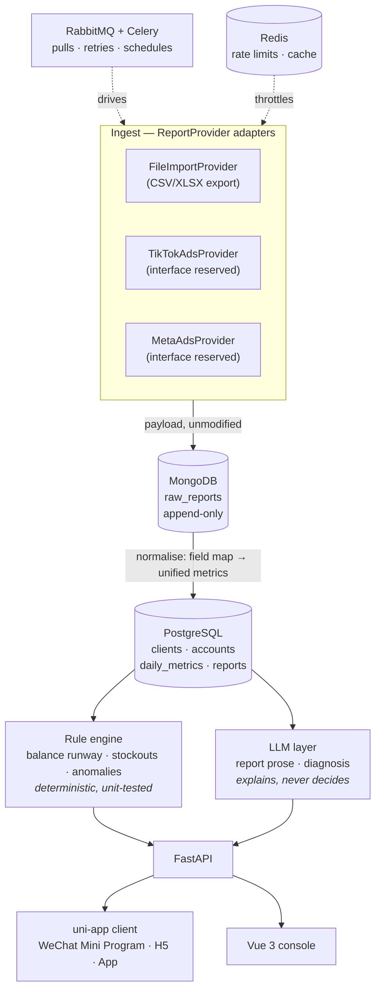

# adpilot

[](https://github.com/maihb/adpilot/actions/workflows/ci.yml)
[](https://www.python.org/downloads/)
[](LICENSE)

**Self-hosted ad performance hub for Meta and TikTok Ads.** Pulls your spend and
conversion data, keeps every raw platform payload for audit, and turns the
numbers into a daily report you can actually hand to a client.

You run it on your own box, against your own ad accounts. No data leaves your
server.

[中文（主）](README.md) · [Design doc (zh)](docs/design/2026-08-19-mvp-design.md)

> **Status: early. Milestone D1–D2 of 14.** The stack boots, health checks pass
> and CI is green. Report ingestion, the client app and the LLM layer are not
> built yet. The [roadmap](#roadmap) marks what is real and what is not — this
> README will never claim a feature that does not exist.

## Why this exists

It was built by someone running ads for clients, to kill four specific chores:

- **Copying numbers by hand.** Export from the ad platform, paste into a sheet,
  work out CPA and ROAS, write the report, send it. Fifteen minutes per client
  per day — and a mistyped figure is worse than no report at all.
- **Balance hitting zero.** TikTok Ads prepaid accounts deduct spend from a cash
  balance. When it empties, ads *stop* — they do not slow down. One stop resets
  a 3–5 day learning phase, and restarting costs another 3–5 days.
- **Stock running out mid-flight.** Ads finally get traction, the hero SKU sells
  out, the learning phase is wasted. Ad data lives in one dashboard, inventory in
  another, and nobody reconciles them.
- **Reports that never match the client's own dashboard.** Attribution windows,
  view-through, cross-device, two platforms both claiming the same order. The fix
  is showing both numbers with the discrepancy explained, not pretending they
  agree.

## How it fits together



### Two databases, one boundary

**Money and relations go to PostgreSQL. Uninterpreted facts go to MongoDB.**

Ad platforms rename and reshape report fields between API versions, and a report
pulled today has to stay auditable months later — *what did this number actually
say back then?* So raw payloads land in MongoDB verbatim and are never updated in
place. Normalisation into `daily_metrics` is a one-way transform that can be
re-run from those snapshots whenever a mapping changes or a bug is fixed.
Settlement figures need transactions and joins, so they live in PostgreSQL.

### Three hard rules for the LLM layer

1. **The LLM never touches money.** Budget changes, pausing ads and bid
   adjustments are proposed, never executed. Models are confidently wrong
   sometimes, ad spend is real money, and a reset learning phase is not
   undoable. Every action needs a human click.
2. **Anything a rule can compute does not go to a model.** Balance runway,
   stockout forecasts, metric deltas against thresholds — all deterministic, all
   unit-tested. The LLM explains and phrases; it does not judge or calculate.
   This keeps the critical path testable, not just cheap.
3. **Output is schema-validated.** Structured output through a Pydantic model,
   retried on mismatch. Raw model text never reaches the database or a client.

Every LLM call records token counts and estimated cost.

## Quick start

Requires Docker and Docker Compose.

```bash
git clone https://github.com/maihb/adpilot.git
cd adpilot

cp .env.example .env
# fill in the blank passwords — the stack refuses to start without them,
# by design: no service in this repo has a default credential
openssl rand -base64 24

docker compose up
```

Then:

| What | Where |
|---|---|
| API docs (Swagger) | http://localhost:8000/docs |
| Liveness | http://localhost:8000/api/health/live |
| Readiness (probes every dependency) | http://localhost:8000/api/health/ready |

### Working on it

```bash
uv sync --all-extras          # install (https://docs.astral.sh/uv/)
uv run uvicorn adpilot.main:app --reload

uv run ruff check . && uv run ruff format --check .
uv run mypy src tests
uv run pytest                 # unit tests, no services needed
RUN_INTEGRATION=1 uv run pytest -m integration   # needs the compose stack
```

Every one of those commands also runs in CI. A check that is merely recommended
rots; if it matters here, it fails the build.

## Stack

| Layer | Choice | Why this one |
|---|---|---|
| API | FastAPI · Python 3.12 · uv | Ad APIs are IO-bound waiting; async is the right model. OpenAPI comes free |
| Transactional store | PostgreSQL 18 | `numeric` money, window functions for period-over-period, JSONB for semi-structured dimensions |
| Raw store | MongoDB 8 | Platform fields drift between versions; snapshots must survive verbatim |
| Queue | RabbitMQ + Celery | Long pulls, rate limits, retries with backoff. Real acks and a dead-letter queue — a lost task is a missing day of data |
| Cache / limits | Redis 7 | Token buckets shared across workers, hot aggregate cache |
| Client | uni-app 3 + Vue 3 + TS | One codebase → WeChat Mini Program, H5 and App. Clients scan a code and look; no install, no account |
| Console | Vue 3 + Element Plus | Internal operator UI, density first |
| LLM | Any OpenAI-compatible endpoint | Not bound to a vendor — DeepSeek, Kimi, Qwen, local Ollama or vLLM all work. Claude and Gemini adapters ship as examples |

## Roadmap

| Milestone | Scope | Done when | Status |
|---|---|---|---|
| D1–D2 | Skeleton, compose stack, CI | `docker compose up` works, CI green | ✅ |
| D3–D5 | Domain model, file import, REST API | Import a CSV, query normalised daily metrics | ⬜ |
| D6–D8 | Celery + RabbitMQ, Mongo snapshots, rule engine | Tasks run async with retries; balance alert fires | ⬜ |
| D9–D11 | uni-app client | Mini Program and H5 both running | ⬜ |
| D12–D13 | LLM reports and diagnosis | Report carries the one line of plain English that matters | ⬜ |
| D14 | Docs, screenshots, deploy | A stranger can run it within five minutes | ⬜ |

**Deliberately out of scope for v1:** no live Ads API (the adapter interface is
reserved — platform app review takes longer than this milestone), no multi-tenant
SaaS mode, no automated budget changes, no creative asset management.

## Contributing

Issues and PRs welcome. CI must be green: `ruff`, `mypy --strict`, and tests.

## License

[MIT](LICENSE)
