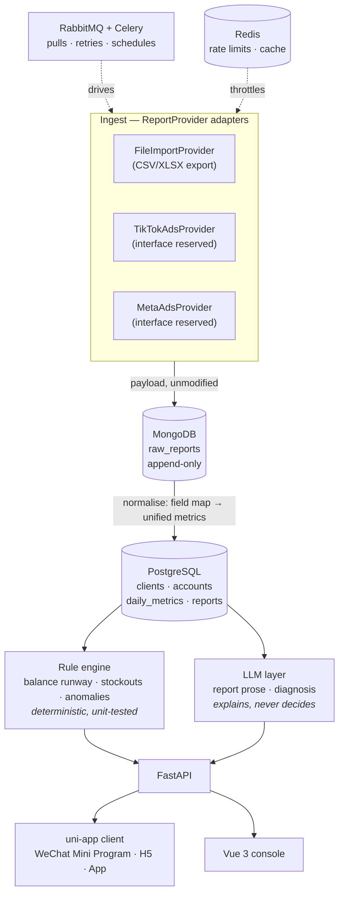

# adpilot

[](https://github.com/maihb/adpilot/actions/workflows/ci.yml)
[](https://www.python.org/downloads/)
[](LICENSE)

**Self-hosted ad performance hub for Meta and TikTok Ads.** Pulls your spend and
conversion data, keeps every raw platform payload for audit, and turns the
numbers into a daily report you can actually hand to a client.

You run it on your own box, against your own ad accounts. No data leaves your
server.

[中文（主）](README.md) · [Design doc (zh)](docs/design/2026-08-19-mvp-design.md)

> **Status: milestone D1–D14 of 14 — the feature scope is done.** The chain is:
> import a CSV → raw snapshot → normalised daily metrics → rule sweep → alert
> push → **daily report** (numbers computed in code, prose drafted by an LLM,
> publishable only after a human edits it) → the client sees the published one.
> Both front ends are in: an operator edits and publishes in the admin console,
> and the client app only ever shows published reports. The [roadmap](#roadmap) marks what
> is real and what is not — this README will never claim a feature that does not
> exist.

## Why this exists

It was built by someone running ads for clients, to kill four specific chores:

- **Copying numbers by hand.** Export from the ad platform, paste into a sheet,
  work out CPA and ROAS, write the report, send it. Fifteen minutes per client
  per day — and a mistyped figure is worse than no report at all.
- **Balance hitting zero.** TikTok Ads prepaid accounts deduct spend from a cash
  balance. When it empties, ads *stop* — they do not slow down. One stop resets
  a 3–5 day learning phase, and restarting costs another 3–5 days.
- **Stock running out mid-flight.** Ads finally get traction, the hero SKU sells
  out, the learning phase is wasted. Ad data lives in one dashboard, inventory in
  another, and nobody reconciles them.
- **Reports that never match the client's own dashboard.** Attribution windows,
  view-through, cross-device, two platforms both claiming the same order. The fix
  is showing both numbers with the discrepancy explained, not pretending they
  agree.

## How it fits together



### Two databases, one boundary

**Money and relations go to PostgreSQL. Uninterpreted facts go to MongoDB.**

Ad platforms rename and reshape report fields between API versions, and a report
pulled today has to stay auditable months later — *what did this number actually
say back then?* So raw payloads land in MongoDB verbatim and are never updated in
place. Normalisation into `daily_metrics` is a one-way transform that can be
re-run from those snapshots whenever a mapping changes or a bug is fixed.
Settlement figures need transactions and joins, so they live in PostgreSQL.

### Three hard rules for the LLM layer

1. **The LLM never touches money.** Budget changes, pausing ads and bid
   adjustments are proposed, never executed. Models are confidently wrong
   sometimes, ad spend is real money, and a reset learning phase is not
   undoable. Every action needs a human click.
2. **Anything a rule can compute does not go to a model.** Balance runway,
   stockout forecasts, metric deltas against thresholds — all deterministic, all
   unit-tested. The LLM explains and phrases; it does not judge or calculate.
   This keeps the critical path testable, not just cheap.
3. **Output is schema-validated.** Structured output through a Pydantic model,
   retried on mismatch. Raw model text never reaches the database or a client.

Every LLM call records token counts and estimated cost.

## Quick start

Requires Docker and Docker Compose. The examples below also use `curl` and `jq`
(only to save a few lines — any other way of reading the token works too).

```bash
git clone https://github.com/maihb/adpilot.git
cd adpilot

cp .env.example .env
# fill in the blank passwords — the stack refuses to start without them,
# by design: no service in this repo has a default credential
openssl rand -base64 24

# Authentication needs two more things (every endpoint requires a login as of D9):
openssl rand -base64 32                        # → put this in AUTH_SECRET

# The operator password is stored as a hash, never in plaintext. --no-deps means it
# does not wait for the databases to become healthy — this step runs before you have
# even filled their passwords in. Paste the whole OPERATOR_PASSWORD_HASH='...' line it
# prints into .env and **keep the single quotes**: compose would otherwise expand the
# $ inside the hash, and the symptom is "login works locally but not under compose".
docker compose run --rm --no-deps api python -m adpilot.auth.password

docker compose up -d

# Create the tables. Auto-migrating on startup is deliberately not done —
# it would mean you never see what it executed.
docker compose run --rm api alembic upgrade head

# Load anonymised sample data. Optional, but without it every endpoint
# below returns an empty list.
docker compose run --rm api python -m adpilot.seed
```

Then:

| What | Where |
|---|---|
| API docs (Swagger) | http://localhost:8000/docs (disabled when `ENVIRONMENT=prod`) |
| Liveness | http://localhost:8000/api/health/live |
| Readiness (probes every dependency) | http://localhost:8000/api/health/ready |

**Apart from those two probes and the two token endpoints, everything requires a
login.** Grab an operator token:

```bash
TOKEN=$(curl -sX POST localhost:8000/api/auth/login \
    -H 'Content-Type: application/json' \
    -d '{"username":"admin","password":"the password you just set"}' | jq -r .token)

curl -H "Authorization: Bearer $TOKEN" localhost:8000/api/clients
```

Clients get in through an **invite code**: an operator generates one, renders it as
a QR code, and the client scans it to receive a 7-day token that can only read
their own data (`/api/portal/*`, read-only). The seed command above prints one code for
**each** sample client when it finishes.

### Client app (H5)

<p align="center">
  
  
</p>

On the left, the report a client receives: the prose only goes out after an
operator has edited it, and the numbers were frozen when it was generated. "What
we did today" carries **why** each change was made — a platform's change log
cannot give you that. On the right, the dashboard: a low balance is red, and
"cannot be computed" shows as `—`, never 0 ([display rules](docs/business/client-app.md)).

The four screens your clients see. It reaches the backend through vite's dev proxy,
so the backend has to be running:

```bash
npm --prefix client install
make client        # H5 dev server, http://localhost:5173 by default
```

Paste any of the invite codes the seed command printed. The three sample clients each
demonstrate a different situation; the accounts under "示例｜户外装备" are paused,
so that one shows **"no recent spend" rather than "0 days left"** — the edge case
this UI is easiest to get wrong.

For WeChat Mini Program, run `npm --prefix client run build:mp-weixin` and import
`client/dist/build/mp-weixin` into WeChat DevTools. **That needs your own AppID**,
which is why H5 is the default demo path — evaluating this project should not start
with registering a Mini Program account.

### Admin console

The operator's own console: imports, alerts, **daily reports**, clients and invite
codes, account detail.

<p align="center">
  
</p>

This screen is where the **human gate** lives: the model's draft is read-only (it
is never overwritten), and an operator has to write their own version before
anything can go out — the server rejects a report that has not been revised, or
one whose "what we did today" is empty. The report in this screenshot has no model
draft because the sample data never calls an LLM (see below).

```bash
npm --prefix admin install
make admin         # http://localhost:5174 (the client app holds 5173; both can run)
```

Log in with the operator credentials from `.env`. Tokens last 8 hours and **do not
slide** — this side has far more power than the client app.

⚠️ **The console is not meant to face the public internet.** This version ships no
network-level isolation (nginx rules, IP allowlists, VPNs are all deployment-shaped
concerns): **its only defence is the operator password plus an 8-hour token.** Where
you put it, and whether it sits behind a private network, is your call — this is
written down so it does not become a silent assumption.

The sample data is 3 clients and 4 ad accounts with 28 days of daily metrics,
spanning Meta / TikTok, three currencies and three time zones, plus one action
log entry per account and a **published report for yesterday**. It **only adds,
never overwrites**, so re-running is safe; it refuses to run when
`ENVIRONMENT=prod`.

⚠️ The prose in that sample report is **canned text, not model output** — loading
sample data should never quietly spend your money, so the seeder never calls an
LLM (a test enforces this). Generate one yourself once `LLM_BASE_URL` is set to
see the "model draft + human revision" pair side by side.

Each account demonstrates a different rule outcome, so one sweep should produce
**exactly** two alerts:

```bash
curl -H "Authorization: Bearer $TOKEN" -X POST localhost:8000/api/alerts/sweep
curl -H "Authorization: Bearer $TOKEN" localhost:8000/api/alerts
```

One is a prepaid account with roughly 2 days of balance left; the other spent the
same money yesterday for half the conversions (CPA doubled). The third account is
healthy, and the fourth is paused — it exists to prove that when average daily
spend is 0, runway is **undefined** rather than zero, and nothing is alerted.
That edge is the one most easily written as "0 days, alert immediately".

### Working on it

The only prerequisite is [uv](https://docs.astral.sh/uv/) — it installs the
Python interpreter itself, per `.python-version`, so you don't need one upfront:

```bash
curl -LsSf https://astral.sh/uv/install.sh | sh   # or brew install uv
```

From there `make help` lists everything. The ones you'll actually use:

```bash
make bootstrap    # new machine, one command: create .env + install from uv.lock
uv run python -m adpilot.auth.password   # generate the operator password hash
                                         #   (interactive — it refuses command-line
                                         #   arguments, which would land in shell history)
make dev          # run the API with hot reload
make worker       # in a second terminal: run the Celery worker on the adpilot queue
make beat         # and a third: run the scheduler (hourly alert sweep depends on it)
make check        # run before pushing: all four CI gates in one go
make migrate      # bring the database up to the latest schema
make seed         # load anonymised sample data (run make migrate first)
make revision m='add column xxx'   # draft a migration after editing models/ — **review it before committing**
make test-int     # integration tests, needs the `make up` stack + `make migrate` first
make client       # client H5 dev server (backend must be running via make dev)
make admin        # admin console dev server (same, on port 5174)
make client-check # both frontends: vue-tsc + the pure-function test files
make openapi      # run after changing backend response shapes: regenerate both frontends' TS types
                  #   skip it and CI's frontend job goes red (types drift from the API)
make up / rebuild / down / logs   # rebuild = rebuild the image after a code change
```

make is shorthand, not logic — `make -n <target>` shows exactly what a target
expands to. The four gates in `make check` match
[CI](.github/workflows/ci.yml) command for command, in the same order: a check
that is merely recommended rots; if it matters here, it fails the build.

## Deploying to a server

⚠️ **This section is a list of constraints, not a deployment recipe that has been
verified.** The author has only ever run this on a local compose stack (and CI),
so what follows is "things that will bite you if you skip them", not "do this and
it works". How to configure a reverse proxy or issue certificates depends on your
machine; this does not pretend to know.

### Three things you must change before going live

| Change | What happens if you don't |
|---|---|
| `ENVIRONMENT=prod` | You lose a set of guardrails: `/docs` and `/openapi.json` stay open (an unauthenticated endpoint that enumerates every route and payload shape), the app starts even without `AUTH_SECRET` or an operator password hash, and `seed` will happily write sample data into your production database |
| Regenerate every password (`openssl rand -base64 24`) | The lines in `.env.example` are **empty**, but whatever you put in your local `.env` was probably typed by hand |
| `AUTH_SECRET` of at least 32 chars (`openssl rand -base64 32`) | A token's payload is publicly readable, so an attacker always holds a (plaintext, signature) pair — a short key is an offline brute-force target. Under `prod` this one is enforced |

### 🔴 Ports: compose maps all four backing services to the host

`docker-compose.yml` declares `ports:` for PostgreSQL, MongoDB, Redis and RabbitMQ
(including the 15672 management UI). That is there for local development —
`.env.example` explains that `*_PORT` serves two purposes: the host port mapping,
and the port the app connects to when you run it outside Docker.

On a machine with a public IP this **exposes four data services plus the RabbitMQ
management console** — and their passwords live in the same `.env`.

**Do at least one of these**: use a compose override file (`-f
docker-compose.yml -f docker-compose.prod.yml`) that drops those `ports` sections
and keeps only the API's, or firewall everything except the API port. Containers
talk to each other by service name, so removing the mappings does not break them.

### Both front ends are static bundles that need somewhere to live

```bash
npm --prefix admin run build      # → admin/dist
npm --prefix client run build:h5  # → client/dist/build/h5
```

Serve each bundle from nginx (or any static server) and reverse-proxy `/api` to
the backend. In development those `/api` calls go through vite's dev proxy; in
production there is no vite — skipping this step looks like "the page loads, but
every click 404s".

⚠️ **Do not put the admin console and the client app on the same domain**, or at
least keep the console out of search engines: it has no network-level isolation,
and its only defence is the operator password plus an 8-hour ticket (see the
"Admin console" section above).

### HTTPS is not optional

Opening the H5 build inside WeChat requires HTTPS; Mini Programs are stricter
still — the request domain must be HTTPS and filed with the Chinese regulator.
That is a platform rule, not something this project chose.

### Upgrading: **migrations do not run themselves**

```bash
git pull
docker compose up -d --build          # `up` checks whether containers run, not whether the image is fresh
docker compose run --rm api alembic upgrade head
```

Keeping the third command separate is deliberate (same reasoning as the schema
step in Quick start): changing a database is a consequential action, and hiding it
behind `up` means nobody sees what it did. **Skipping it shows up as endpoints
failing on unknown columns.**

### Back up both databases — they mean different things

| Database | Holds | If you lose it |
|---|---|---|
| PostgreSQL | Clients, accounts, daily metrics, balances, the action log, **published reports** | Everything is gone. Reports were already sent to clients; you cannot reconstruct them |
| MongoDB | `raw_reports` snapshots, append-only | Normalised results survive, but "what did the platform actually send that day" is unanswerable — and you can no longer re-run normalisation from source |

Redis (cache + task results) and RabbitMQ (queues) **need no backup** — the former
regrows itself, the latter only holds messages still in flight.

## Stack

| Layer | Choice | Why this one |
|---|---|---|
| API | FastAPI · Python 3.12 · uv | Ad APIs are IO-bound waiting; async is the right model. OpenAPI comes free |
| Transactional store | PostgreSQL 18 | `numeric` money, window functions for period-over-period, JSONB for semi-structured dimensions |
| Raw store | MongoDB 8 | Platform fields drift between versions; snapshots must survive verbatim |
| Queue | RabbitMQ + Celery | Long pulls, rate limits, retries with backoff. Real acks and a dead-letter queue — a lost task is a missing day of data |
| Cache / limits | Redis 7 | Token buckets shared across workers, hot aggregate cache |
| Client | uni-app 3 + Vue 3 + TS | One codebase → WeChat Mini Program, H5 and App. Clients scan a code and look; no install, no account |
| Console | Vue 3 + Element Plus | Internal operator UI, density first |
| LLM | Any OpenAI-compatible endpoint | Not bound to a vendor — DeepSeek, Kimi, Qwen, local Ollama or vLLM all work. Claude and Gemini go through their own compatible endpoints, so **no native adapters**: those would only buy their vendor-specific features, and writing a report needs none of them |

## Roadmap

| Milestone | Scope | Done when | Status |
|---|---|---|---|
| D1–D2 | Skeleton, compose stack, CI | `docker compose up` works, CI green | ✅ |
| D3–D5 | Domain model, file import, REST API | Import a CSV, query normalised daily metrics | ✅ |
| D6–D8 | Celery + RabbitMQ, Mongo snapshots, rule engine | Tasks run async with retries; balance alert fires | ✅ |
| D9 | Authentication, authorisation scope, invite codes | Someone else's token cannot reach my data, and a test says so | ✅ |
| D10–D11 | uni-app client | H5 running; Mini Program compiles, runtime needs your own DevTools | ✅ |
| D12 | Vue 3 admin console | Client management, imports and invite codes usable from the UI | ✅ |
| D13 | LLM layer, call cost, action log | With a fake provider: structured input → validation → a row in `llm_calls`; actions can be recorded and queried | ✅ |
| D14 | Report drafting / revision / publishing, anomaly diagnosis | Report carries the one line of plain English that matters, and an unrevised one cannot be published | ✅ |
| D15 | Docs, screenshots, deploy | A stranger can run it within five minutes | ✅ |

**Deliberately out of scope for v1:** no live Ads API (the adapter interface is
reserved — platform app review takes longer than this milestone), no multi-tenant
SaaS mode, no automated budget changes, no creative asset management, no user
management (the operator account comes from environment variables — single
instance, single operator), no token revocation list (the price of self-contained
tokens, see the [auth notes](docs/business/auth.md), in Chinese).

## Contributing

Issues and PRs welcome. CI must be green: `ruff`, `mypy --strict`, and tests.

## License

[MIT](LICENSE)
