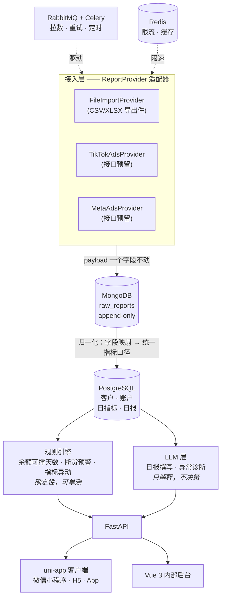

# adpilot

[](https://github.com/maihb/adpilot/actions/workflows/ci.yml)
[](https://www.python.org/downloads/)
[](LICENSE)

**自托管的 Meta / TikTok 广告投放数据中台。** 把投放花费和转化数据拉进来，原样留存
每一份平台回传的 payload 以备审计，再把这些数字变成一份能直接发给客户的日报。

部署在你自己的机器上，连你自己的广告账户，数据不出你的服务器。

[English](README.en.md) · [设计文档](docs/design/2026-08-19-mvp-design.md)

> **状态：早期，14 个里程碑里的 D1–D2。** 目前整套环境能起来、健康检查通过、CI 是绿的。
> 报表接入、客户端和 LLM 层都还没做。[路线图](#路线图)标明了哪些是真的、哪些还没有 ——
> 这份 README 不会声称任何不存在的功能。

## 为什么做这个

作者本人在给客户投流，做它是为了干掉四件具体的苦差事：

- **每天手工搬数字。** 从平台后台导出、粘进表格、算 CPA 和 ROAS、写日报、发出去。
  一个客户 15 分钟，而抄错一个数比不发日报更糟。
- **余额归零广告直接停。** TikTok Ads 预充值账户从余额里扣花费，余额空了广告是**停**，
  不是降速。停一次，3–5 天的学习期就白跑了，重开还要再等 3–5 天。
- **库存跟不上投放速度。** 广告刚跑出量，主推款断货，学习期作废。投放数据在一个后台、
  库存在另一个后台，没人对得上。
- **报表永远和客户自己的后台对不上。** 归因窗口、浏览归因、跨设备、两个平台同时给
  同一单邀功。正确做法是把两个数字都列出来并解释差异，而不是想办法让它们一致。

## 怎么串起来的



### 两个库，一条边界

**钱和关系走 PostgreSQL，未经解释的原始事实走 MongoDB。**

广告平台会在 API 版本之间改字段名和结构，而今天拉的报表几个月后还得查得到 ——
*当时这个数到底是多少？* 所以原始 payload 原样落进 MongoDB，永不原地修改；
归一化进 `daily_metrics` 是一次单向转换，映射规则变了或发现 bug，随时能拿快照重跑。
结算金额需要事务和 JOIN，所以放 PostgreSQL。

### LLM 层的三条硬边界

1. **LLM 不碰钱。** 改预算、关广告、调出价一律只建议不执行。模型有时会自信地犯错，
   而广告费是真金白银，学习期被重置是不可撤销的。每个动作都要人点一下。
2. **规则能算的绝不交给模型。** 余额可撑天数、断货预测、指标环比阈值 —— 全是确定性
   计算，全部有单测。LLM 只负责解释和表达，不负责判断和计算。这不只是省钱，
   是让关键路径可测试。
3. **输出必须过 schema 校验。** 走 Pydantic 结构化输出，不匹配就重试。
   模型的裸文本永远不会直接进数据库或发给客户。

每次 LLM 调用都记录 token 数与预估成本。

## 快速开始

需要 Docker 与 Docker Compose。

```bash
git clone https://github.com/maihb/adpilot.git
cd adpilot

cp .env.example .env
# 把空着的密码填上 —— 不填这套栈起不来，这是故意的：
# 本仓库里没有任何服务带默认凭据
openssl rand -base64 24

# 认证也要两样东西（D9 起接口全部要登录）：
openssl rand -base64 32                        # → 填进 AUTH_SECRET
uv run python -m adpilot.auth.password         # 交互式输入密码，把它打印的那行
                                               #   OPERATOR_PASSWORD_HASH='...' 整行贴进 .env
                                               #   **单引号不能省**，哈希里的 $ 会被 compose 展开

docker compose up -d

# 建表。刻意不做「启动时自动迁移」—— 那意味着你看不见它执行了什么
docker compose run --rm api alembic upgrade head

# 灌一批脱敏示例数据。不灌也能跑，但下面每个接口都会返回空列表
docker compose run --rm api python -m adpilot.seed
```

然后：

| 什么 | 地址 |
|---|---|
| 接口文档（Swagger） | http://localhost:8000/docs（`ENVIRONMENT=prod` 时关闭） |
| 存活探针 | http://localhost:8000/api/health/live |
| 就绪探针（逐个探测依赖） | http://localhost:8000/api/health/ready |

**除了这两个探针和两个换 token 的入口，所有接口都要登录。** 拿一张运营票：

```bash
TOKEN=$(curl -sX POST localhost:8000/api/auth/login \
    -H 'Content-Type: application/json' \
    -d '{"username":"admin","password":"你刚才设的密码"}' | jq -r .token)

curl -H "Authorization: Bearer $TOKEN" localhost:8000/api/clients
```

客户那一侧走**邀请码**：运营给某个客户生成一个码，渲染成二维码发出去，客户扫了就
换到一张 7 天的票，之后只能看自己的数据（`/api/portal/*`，全只读）。`make seed`
跑完会给**每个**示例客户各打印一个码。

### 客户端（H5）

客户看到的那四屏。它走 vite 的 dev proxy 连后端，所以后端要先跑着：

```bash
npm --prefix client install
make client        # 起 H5 开发服务器（默认 http://localhost:5173）
```

打开之后把 `make seed` 打印的任意一个邀请码粘进去。三个示例客户各演示一种情况，
其中「示例｜户外装备」的账户已暂停投放 —— 用它可以看到**「近期无消耗」而不是
「还能撑 0 天」**，那是这套界面里最容易写错的一条边界。

微信小程序端是 `npm --prefix client run build:mp-weixin`，产物用微信开发者工具
导入 `client/dist/build/mp-weixin`。**它需要你自己的 AppID**，所以 H5 是默认的
演示路径 —— 评估这个项目不该先要求你去注册一个小程序账号。

示例数据是 3 个客户、4 个广告账户、28 天日指标，跨 Meta / TikTok、跨三种币种与三个
时区。它**只添不改**，重复跑安全；`ENVIRONMENT=prod` 时直接拒绝执行。

四个账户各自演示一种规则结局，所以跑一次巡检应当**恰好**得到两条告警：

```bash
curl -H "Authorization: Bearer $TOKEN" -X POST localhost:8000/api/alerts/sweep
curl -H "Authorization: Bearer $TOKEN" localhost:8000/api/alerts
```

一条是余额只够撑约 2 天的预充账户，一条是昨天花一样的钱、转化少了一半（CPA 翻倍）
的账户。第三个账户一切正常，第四个暂停投放 —— 它专门用来验证「日均消耗为 0 时可撑
天数是**无定义**，不告警」，那条边界最容易被写成「0 天，立刻告警」。

### 开发

只需要装 [uv](https://docs.astral.sh/uv/) —— Python 解释器它会照
`.python-version` 一起装好，不用预先准备：

```bash
curl -LsSf https://astral.sh/uv/install.sh | sh   # 或 brew install uv
```

之后 `make help` 是完整清单，常用的是这几条：

```bash
make bootstrap    # 新机器就跑这一条：生成 .env + 按 uv.lock 装依赖
uv run python -m adpilot.auth.password   # 生成运营密码哈希（交互式，不接受命令行参数
                                         #   —— 那会把明文写进 shell history）
make dev          # 起接口服务，热重载
make worker       # 另开一个终端：起 Celery worker，消费 adpilot 队列
make beat         # 再开一个：起定时排期（每小时的告警巡检靠它）
make check        # 推送前跑这条：CI 卡的四道门禁一次跑完
make migrate      # 把库升到最新 schema
make seed         # 灌脱敏示例数据（先 make migrate）
make revision m='加一列 xxx'   # 改完 models/ 生成迁移草稿，**要人看一遍再提交**
make test-int     # 集成测试，需要 make up 那套环境 + 先 make migrate
make client       # 起客户端 H5 开发服务器（后端要先 make dev 跑着）
make client-check # 客户端门禁：vue-tsc + 三个纯函数的单测
make openapi      # 改了后端出参形状之后跑它：重新生成前端 TS 类型
                  #   不跑的话 CI 的 frontend job 会红（类型和后端对不上）
make up / rebuild / down / logs   # rebuild = 改了代码之后重建镜像再换上去
```

make 只是短名字，没有额外逻辑 —— 每个 target 展开成什么，`make -n <target>` 一看
便知。`make check` 的四道门禁与 [CI](.github/workflows/ci.yml) 同序同命令：只写在
文档里、没有机器执行的检查一定会腐化；在这个仓库里，重要的事就得能让构建失败。

## 技术栈

| 层 | 选型 | 为什么是它 |
|---|---|---|
| 接口 | FastAPI · Python 3.12 · uv | 广告 API 是大量 IO 等待，async 是对的模型；OpenAPI 白送 |
| 事务库 | PostgreSQL 18 | `numeric` 精确金额、窗口函数算环比、JSONB 存半结构化维度 |
| 原始库 | MongoDB 8 | 平台字段随版本漂移，快照必须原样留存 |
| 队列 | RabbitMQ + Celery | 长任务、限速、退避重试。要真正的 ack 和死信队列 —— 任务丢了就是缺一天数据 |
| 缓存 / 限流 | Redis 7 | 多 worker 共享令牌桶，热点聚合缓存 |
| 客户端 | uni-app 3 + Vue 3 + TS | 一套代码出微信小程序 / H5 / App。客户是小商家，扫码就能看，不装 App 不注册 |
| 内部后台 | Vue 3 + Element Plus | 运营操作台，密度优先 |
| LLM | 任何兼容 OpenAI 协议的服务 | 不绑定厂商 —— DeepSeek、Kimi、通义、本地 Ollama 或 vLLM 都能接；Claude 与 Gemini 适配器作为示例 |

## 路线图

| 里程碑 | 范围 | 验收标准 | 状态 |
|---|---|---|---|
| D1–D2 | 骨架、compose 环境、CI | `docker compose up` 能跑，CI 绿灯 | ✅ |
| D3–D5 | 领域模型、文件导入、REST 接口 | 导入一份 CSV，能查出归一化日指标 | ✅ |
| D6–D8 | Celery + RabbitMQ、Mongo 快照、规则引擎 | 任务异步执行且能重试，余额告警能触发 | ✅ |
| D9 | 认证、授权作用域、邀请码 | 拿别人的 token 查不到我的数据，且有测试盯着 | ✅ |
| D10–D11 | uni-app 客户端 | H5 端可用；小程序端编译通过，运行时需自备开发者工具 | ✅ |
| D12 | Vue 3 内部后台 | 客户管理、导入、邀请码生成能在页面上走完 | ⬜ |
| D13–D14 | LLM 日报与诊断 | 日报里有那一行说人话的结论 | ⬜ |
| D15 | 文档、截图、部署 | 陌生人能在五分钟内跑起来 | ⬜ |

**v1 刻意不做：** 不接 Ads API（适配器接口已预留 —— 平台应用审核比这个里程碑还长）、
不做多租户 SaaS、不做自动改预算、不做素材管理、不做用户管理（运营账号从环境变量来，
单实例单使用者）、不做 token 撤销列表（自包含 token 的代价，见
[认证文档](docs/business/auth.md)）。

## 参与

欢迎提 issue 和 PR。CI 必须绿：`ruff`、`mypy --strict`、测试。

## 许可

[MIT](LICENSE)
