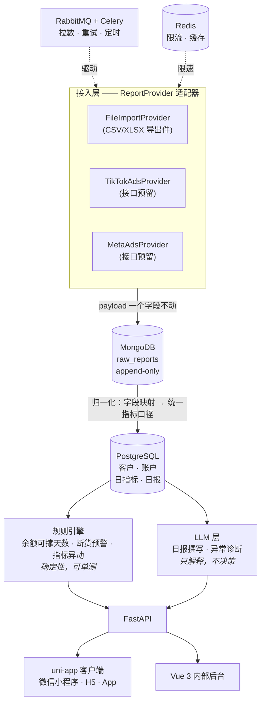

# adpilot

**自托管的 Meta / TikTok 广告投放数据中台。** 把投放花费和转化数据拉进来，原样留存
每一份平台回传的 payload 以备审计，再把这些数字变成一份能直接发给客户的日报。

部署在你自己的机器上，连你自己的广告账户，数据不出你的服务器。

[English](README.en.md) · [设计文档](docs/design/2026-08-19-mvp-design.md)

> **状态：早期，14 个里程碑里的 D1–D2。** 目前整套环境能起来、健康检查通过、CI 是绿的。
> 报表接入、客户端和 LLM 层都还没做。[路线图](#路线图)标明了哪些是真的、哪些还没有 ——
> 这份 README 不会声称任何不存在的功能。

## 为什么做这个

作者本人在给客户投流，做它是为了干掉四件具体的苦差事：

- **每天手工搬数字。** 从平台后台导出、粘进表格、算 CPA 和 ROAS、写日报、发出去。
  一个客户 15 分钟，而抄错一个数比不发日报更糟。
- **余额归零广告直接停。** TikTok Ads 预充值账户从余额里扣花费，余额空了广告是**停**，
  不是降速。停一次，3–5 天的学习期就白跑了，重开还要再等 3–5 天。
- **库存跟不上投放速度。** 广告刚跑出量，主推款断货，学习期作废。投放数据在一个后台、
  库存在另一个后台，没人对得上。
- **报表永远和客户自己的后台对不上。** 归因窗口、浏览归因、跨设备、两个平台同时给
  同一单邀功。正确做法是把两个数字都列出来并解释差异，而不是想办法让它们一致。

## 怎么串起来的



### 两个库，一条边界

**钱和关系走 PostgreSQL，未经解释的原始事实走 MongoDB。**

广告平台会在 API 版本之间改字段名和结构，而今天拉的报表几个月后还得查得到 ——
*当时这个数到底是多少？* 所以原始 payload 原样落进 MongoDB，永不原地修改；
归一化进 `daily_metrics` 是一次单向转换，映射规则变了或发现 bug，随时能拿快照重跑。
结算金额需要事务和 JOIN，所以放 PostgreSQL。

### LLM 层的三条硬边界

1. **LLM 不碰钱。** 改预算、关广告、调出价一律只建议不执行。模型有时会自信地犯错，
   而广告费是真金白银，学习期被重置是不可撤销的。每个动作都要人点一下。
2. **规则能算的绝不交给模型。** 余额可撑天数、断货预测、指标环比阈值 —— 全是确定性
   计算，全部有单测。LLM 只负责解释和表达，不负责判断和计算。这不只是省钱，
   是让关键路径可测试。
3. **输出必须过 schema 校验。** 走 Pydantic 结构化输出，不匹配就重试。
   模型的裸文本永远不会直接进数据库或发给客户。

每次 LLM 调用都记录 token 数与预估成本。

## 快速开始

需要 Docker 与 Docker Compose。

```bash
git clone https://github.com/maihb/adpilot.git
cd adpilot

cp .env.example .env
# 把空着的密码填上 —— 不填这套栈起不来，这是故意的：
# 本仓库里没有任何服务带默认凭据
openssl rand -base64 24

docker compose up
```

然后：

| 什么 | 地址 |
|---|---|
| 接口文档（Swagger） | http://localhost:8000/docs |
| 存活探针 | http://localhost:8000/api/health/live |
| 就绪探针（逐个探测依赖） | http://localhost:8000/api/health/ready |

### 开发

```bash
uv sync --all-extras          # 安装依赖（https://docs.astral.sh/uv/）
uv run uvicorn adpilot.main:app --reload

uv run ruff check . && uv run ruff format --check .
uv run mypy src tests
uv run pytest                 # 单元测试，不需要任何外部服务
RUN_INTEGRATION=1 uv run pytest -m integration   # 需要 compose 那套环境
```

上面每一条都同时跑在 CI 里。只写在文档里、没有机器执行的检查一定会腐化；
在这个仓库里，重要的事就得能让构建失败。

## 技术栈

| 层 | 选型 | 为什么是它 |
|---|---|---|
| 接口 | FastAPI · Python 3.12 · uv | 广告 API 是大量 IO 等待，async 是对的模型；OpenAPI 白送 |
| 事务库 | PostgreSQL 18 | `numeric` 精确金额、窗口函数算环比、JSONB 存半结构化维度 |
| 原始库 | MongoDB 8 | 平台字段随版本漂移，快照必须原样留存 |
| 队列 | RabbitMQ + Celery | 长任务、限速、退避重试。要真正的 ack 和死信队列 —— 任务丢了就是缺一天数据 |
| 缓存 / 限流 | Redis 7 | 多 worker 共享令牌桶，热点聚合缓存 |
| 客户端 | uni-app 3 + Vue 3 + TS | 一套代码出微信小程序 / H5 / App。客户是小商家，扫码就能看，不装 App 不注册 |
| 内部后台 | Vue 3 + Element Plus | 运营操作台，密度优先 |
| LLM | 任何兼容 OpenAI 协议的服务 | 不绑定厂商 —— DeepSeek、Kimi、通义、本地 Ollama 或 vLLM 都能接；Claude 与 Gemini 适配器作为示例 |

## 路线图

| 里程碑 | 范围 | 验收标准 | 状态 |
|---|---|---|---|
| D1–D2 | 骨架、compose 环境、CI | `docker compose up` 能跑，CI 绿灯 | ✅ |
| D3–D5 | 领域模型、文件导入、REST 接口 | 导入一份 CSV，能查出归一化日指标 | ⬜ |
| D6–D8 | Celery + RabbitMQ、Mongo 快照、规则引擎 | 任务异步执行且能重试，余额告警能触发 | ⬜ |
| D9–D11 | uni-app 客户端 | 微信小程序与 H5 双端可用 | ⬜ |
| D12–D13 | LLM 日报与诊断 | 日报里有那一行说人话的结论 | ⬜ |
| D14 | 文档、截图、部署 | 陌生人能在五分钟内跑起来 | ⬜ |

**v1 刻意不做：** 不接 Ads API（适配器接口已预留 —— 平台应用审核比这个里程碑还长）、
不做多租户 SaaS、不做自动改预算、不做素材管理。

## 参与

欢迎提 issue 和 PR。CI 必须绿：`ruff`、`mypy --strict`、测试。

## 许可

[MIT](LICENSE)
