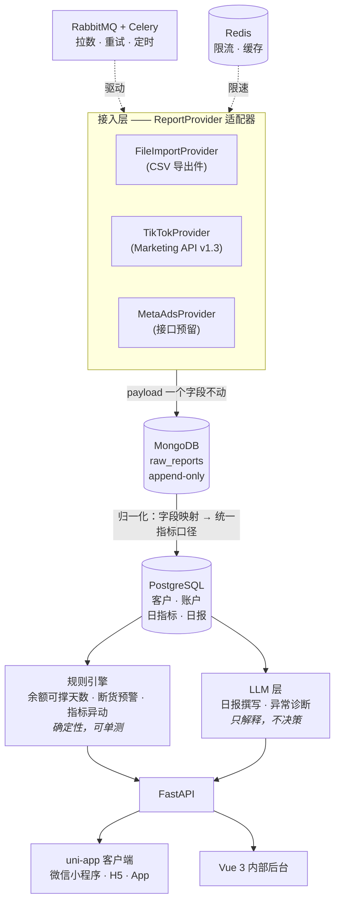
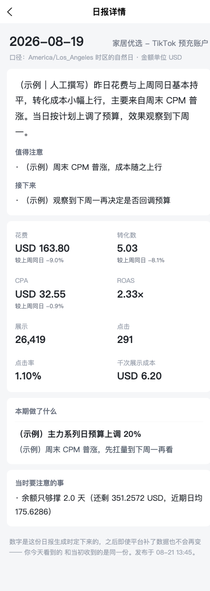
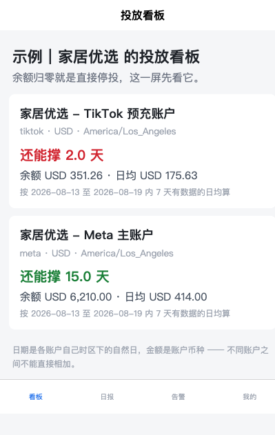
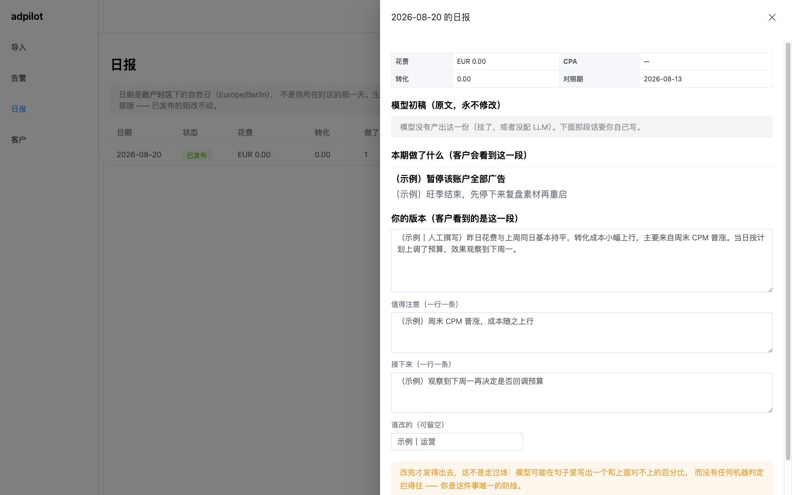

# adpilot

[](https://github.com/maihb/adpilot/actions/workflows/ci.yml)
[](https://www.python.org/downloads/)
[](LICENSE)

**自托管的 Meta / TikTok 广告投放数据中台。** 把投放花费和转化数据拉进来，原样留存
每一份平台回传的 payload 以备审计，再把这些数字变成一份能直接发给客户的日报。

部署在你自己的机器上，连你自己的广告账户，数据不出你的服务器。

[English](README.en.md) · [设计文档](docs/design/2026-08-19-mvp-design.md)

> **状态：19 个里程碑里的 D1–D19，MVP 范围已全部走完。** 整条链是：**从平台 API
> 拉数**（或导入 CSV）→ 原始快照 → 归一化日指标 → 规则巡检 → 告警推送 → **日报**
> （数字由代码算、人话由 LLM 起草、人改完才能发）→ 客户端只看得到已发布的那份。
> 两个前端都跟上了：运营在后台改完才发得出去，客户在小程序/H5 上只看得到已发布的。
> D19 起 TikTok 那条是自动的 —— 而**拉不到数会开一条告警**，因为「昨天花了 0 元」
> 和「拉取停了」在看板上长得一模一样。
> [路线图](#路线图)标明了哪些是真的、哪些还没有 —— 这份 README 不会声称任何不
> 存在的功能。

## 为什么做这个

作者本人在给客户投流，做它是为了干掉四件具体的苦差事：

- **每天手工搬数字。** 从平台后台导出、粘进表格、算 CPA 和 ROAS、写日报、发出去。
  一个客户 15 分钟，而抄错一个数比不发日报更糟。
- **余额归零广告直接停。** TikTok Ads 预充值账户从余额里扣花费，余额空了广告是**停**，
  不是降速。停一次，3–5 天的学习期就白跑了，重开还要再等 3–5 天。
- **库存跟不上投放速度。** 广告刚跑出量，主推款断货，学习期作废。投放数据在一个后台、
  库存在另一个后台，没人对得上。
- **报表永远和客户自己的后台对不上。** 归因窗口、浏览归因、跨设备、两个平台同时给
  同一单邀功。正确做法是把两个数字都列出来并解释差异，而不是想办法让它们一致。

## 怎么串起来的



### 两个库，一条边界

**钱和关系走 PostgreSQL，未经解释的原始事实走 MongoDB。**

广告平台会在 API 版本之间改字段名和结构，而今天拉的报表几个月后还得查得到 ——
*当时这个数到底是多少？* 所以原始 payload 原样落进 MongoDB，永不原地修改；
归一化进 `daily_metrics` 是一次单向转换，映射规则变了或发现 bug，随时能拿快照重跑。
结算金额需要事务和 JOIN，所以放 PostgreSQL。

### LLM 层的三条硬边界

1. **LLM 不碰钱。** 改预算、关广告、调出价一律只建议不执行。模型有时会自信地犯错，
   而广告费是真金白银，学习期被重置是不可撤销的。每个动作都要人点一下。
2. **规则能算的绝不交给模型。** 余额可撑天数、断货预测、指标环比阈值 —— 全是确定性
   计算，全部有单测。LLM 只负责解释和表达，不负责判断和计算。这不只是省钱，
   是让关键路径可测试。
3. **输出必须过 schema 校验。** 走 Pydantic 结构化输出，不匹配就重试。
   模型的裸文本永远不会直接进数据库或发给客户。

每次 LLM 调用都记录 token 数与预估成本。

## 快速开始

需要 Docker 与 Docker Compose。下面的例子还用到 `curl` 和 `jq`（只是为了少写几行，
换成别的取值方式一样）。

```bash
git clone https://github.com/maihb/adpilot.git
cd adpilot

cp .env.example .env
# 把空着的密码填上 —— 不填这套栈起不来，这是故意的：
# 本仓库里没有任何服务带默认凭据
openssl rand -base64 24

# 认证也要两样东西（D9 起接口全部要登录）：
openssl rand -base64 32                        # → 填进 AUTH_SECRET

# 运营密码存哈希不存明文。--no-deps 让它不必等数据库先健康 —— 这一步本来就跑在
# 填完密码之前。把它打印的那行 OPERATOR_PASSWORD_HASH='...' 整行贴进 .env，
# **单引号不能省**：哈希里的 $ 会被 compose 当变量展开，症状是「本机登录得了、
# compose 起的那套登录不了」。
docker compose run --rm --no-deps api python -m adpilot.auth.password

docker compose up -d

# 建表。刻意不做「启动时自动迁移」—— 那意味着你看不见它执行了什么
docker compose run --rm api alembic upgrade head

# 灌一批脱敏示例数据。不灌也能跑，但下面每个接口都会返回空列表
docker compose run --rm api python -m adpilot.seed
```

然后：

| 什么 | 地址 |
|---|---|
| 接口文档（Swagger） | http://localhost:8000/docs（`ENVIRONMENT=prod` 时关闭） |
| 存活探针 | http://localhost:8000/api/health/live |
| 就绪探针（逐个探测依赖） | http://localhost:8000/api/health/ready |

**除了这两个探针和两个换 token 的入口，所有接口都要登录。** 拿一张运营票：

```bash
TOKEN=$(curl -sX POST localhost:8000/api/auth/login \
    -H 'Content-Type: application/json' \
    -d '{"username":"admin","password":"你刚才设的密码"}' | jq -r .token)

curl -H "Authorization: Bearer $TOKEN" localhost:8000/api/clients
```

客户那一侧走**邀请码**：运营给某个客户生成一个码，渲染成二维码发出去，客户扫了就
换到一张 7 天的票，之后只能看自己的数据（`/api/portal/*`，全只读）。上面那条 seed
命令跑完会给**每个**示例客户各打印一个码 —— 每次跑都是新的，且只显示这一次。

### 客户端（H5）

<p align="center">
  
  
</p>

左边是客户收到的日报：那段话经运营确认才发出来，数字是生成那一刻定死的；「本期做了
什么」带着**为什么这么调** —— 平台的变更日志给不出那一句。右边是看板，余额告急标红，
而「算不出来」显示成 `—` 不是 0（[口径规则](docs/business/client-app.md)）。


客户看到的那四屏。它走 vite 的 dev proxy 连后端，所以后端要先跑着：

```bash
npm --prefix client install
make client        # 起 H5 开发服务器（默认 http://localhost:5173）
```

打开之后把 seed 打印的任意一个邀请码粘进去。三个示例客户各演示一种情况，
其中「示例｜户外装备」的账户已暂停投放 —— 用它可以看到**「近期无消耗」而不是
「还能撑 0 天」**，那是这套界面里最容易写错的一条边界。

微信小程序端是 `npm --prefix client run build:mp-weixin`，产物用微信开发者工具
导入 `client/dist/build/mp-weixin`。**它需要你自己的 AppID**，所以 H5 是默认的
演示路径 —— 评估这个项目不该先要求你去注册一个小程序账号。

### 内部后台

运营自己的操作台：导入、告警、**日报**、客户与邀请码、账户明细。

<p align="center">
  
</p>

日报这一屏是那道**人工闸门**所在：模型的初稿只读（永不修改），运营改完自己那一版才
发得出去 —— 未经修订的、以及「本期做了什么」为空的，服务端直接拒。截图里这份没有
模型初稿，因为示例数据不调用 LLM（见下）。

```bash
npm --prefix admin install
make admin         # http://localhost:5174（客户端占着 5173，两个能同时跑）
```

用 `.env` 里那对运营账号密码登录。票 8 小时，**不滑动续期** —— 后台的权限比客户端
大得多。

⚠️ **后台不该暴露在公网。** 这一版没有网络层隔离（nginx 规则、IP 白名单、VPN 都是
部署形态的事），**它唯一的防线是运营的账号密码 + 8 小时的票**。放到哪台机器上、
要不要挡在内网后面，是部署者的决定 —— 这句话写在这里是为了不让它成为一个默认假设。

示例数据是 3 个客户、4 个广告账户、28 天日指标，跨 Meta / TikTok、跨三种币种与三个
时区，外加每个账户一条投放操作记录、一份**已发布的昨日日报**，以及 3 个带库存快照
的商品。它**只添不改**，重复跑安全；`ENVIRONMENT=prod` 时直接拒绝执行。

⚠️ 那份示例日报里的人话是**写死的示例文案，不是模型写的** —— 灌一次示例数据不该
悄悄花你的钱，所以 seed 绝不调用 LLM（有测试盯着）。配好 `LLM_BASE_URL` 之后自己
生成一份，才看得到「模型原文 + 人工修订」两版并存。

四个账户和三个商品各自演示一种规则结局，所以跑一次巡检应当**恰好**得到三条告警：

```bash
curl -H "Authorization: Bearer $TOKEN" -X POST localhost:8000/api/alerts/sweep
curl -H "Authorization: Bearer $TOKEN" localhost:8000/api/alerts
```

一条是余额只够撑约 2 天的预充账户，一条是昨天花一样的钱、转化少了一半（CPA 翻倍）
的账户，一条是库存只够撑三天多的主推款 —— 最后这条的 `account_id` 是 `null`，因为
商品挂在客户上（一个客户的几个投放账户推的是同一批货）。

剩下三个演示的是**不该告警**的情形，而它们比会告警的那几个更值得看：一个账户暂停
投放（日均消耗为 0），一个商品只有一条库存快照（推不出日均销量）—— 两者的可撑天数
都是**无定义**，不是 0。那条边界最容易被写成「0 天，立刻告警」，而那样的告警会让人
对整个列表脱敏。

### 开发

只需要装 [uv](https://docs.astral.sh/uv/) —— Python 解释器它会照
`.python-version` 一起装好，不用预先准备：

```bash
curl -LsSf https://astral.sh/uv/install.sh | sh   # 或 brew install uv
```

之后 `make help` 是完整清单，常用的是这几条：

```bash
make bootstrap    # 新机器就跑这一条：生成 .env + 按 uv.lock 装依赖
uv run python -m adpilot.auth.password   # 生成运营密码哈希（交互式，不接受命令行参数
                                         #   —— 那会把明文写进 shell history）
make dev          # 起接口服务，热重载
make worker       # 另开一个终端：起 Celery worker，消费 adpilot 队列
make beat         # 再开一个：起定时排期（每小时的告警巡检和定时日报都靠它）
make check        # 推送前跑这条：CI 卡的四道门禁一次跑完
make migrate      # 把库升到最新 schema
make seed         # 灌脱敏示例数据（先 make migrate）
make revision m='加一列 xxx'   # 改完 models/ 生成迁移草稿，**要人看一遍再提交**
make test-int     # 集成测试，需要 make up 那套环境 + 先 make migrate
make client       # 起客户端 H5 开发服务器（后端要先 make dev 跑着）
make admin        # 起内部后台开发服务器（同上，端口 5174）
make client-check # 两个前端的门禁：vue-tsc + 纯函数单测
make openapi      # 改了后端出参形状之后跑它：重新生成两个前端的 TS 类型
                  #   不跑的话 CI 的 frontend job 会红（类型和后端对不上）
make up / rebuild / down / logs   # rebuild = 改了代码之后重建镜像再换上去
```

make 只是短名字，没有额外逻辑 —— 每个 target 展开成什么，`make -n <target>` 一看
便知。`make check` 的四道门禁与 [CI](.github/workflows/ci.yml) 同序同命令：只写在
文档里、没有机器执行的检查一定会腐化；在这个仓库里，重要的事就得能让构建失败。

## 部署到一台服务器

⚠️ **这一节是约束清单，不是一套验证过的部署方案。** 作者只在本机的 compose 上跑过
（CI 也一样），所以下面写的是「不这么做会出事」的已知项，而不是「照着做就行」的
教程。反向代理怎么配、证书怎么签，各家机器不一样，这里不假装知道。

### 上线前必须改的三件事

| 改什么 | 不改会怎样 |
|---|---|
| `ENVIRONMENT=prod` | 少一组护栏：`/docs` 和 `/openapi.json` 仍然对外开着（一个免认证、能枚举全部路由与出入参的入口）、`AUTH_SECRET` 和运营密码哈希缺了也照样启动、`seed` 还能往生产库里灌示例数据 |
| 所有密码重新生成（`openssl rand -base64 24`） | `.env.example` 里那几行是**空的**，但你本机 `.env` 里那套多半是随手写的 |
| `AUTH_SECRET` 至少 32 字符（`openssl rand -base64 32`） | token 的 payload 是公开可读的，攻击者手里天然有一对（明文, 签名）—— 密钥短了就是离线爆破的活靶子。`prod` 下这一条会被强制 |

### 🔴 端口：compose 默认把四个后端服务都映射到宿主机

`docker-compose.yml` 里 PostgreSQL、MongoDB、Redis、RabbitMQ（含 15672 管理台）
**都有 `ports:`**。那是给本机开发准备的（`.env.example` 里写着 `*_PORT` 有两个用途：
宿主机映射，以及本机直接跑时应用连的端口）。

放到一台有公网 IP 的机器上，这等于**把四个数据服务连同 RabbitMQ 管理台一起暴露出
去** —— 而它们的密码就在同一个 `.env` 里。

**至少要做一件**：用一个 compose 覆盖文件（`-f docker-compose.yml -f
docker-compose.prod.yml`）把那几段 `ports` 去掉，只留 API 那一个；或者用防火墙只放
API 的端口。容器之间走服务名通信，删掉映射不影响它们互相连。

### 两个前端是静态产物，需要一个地方放

```bash
npm --prefix admin run build      # → admin/dist
npm --prefix client run build:h5  # → client/dist/build/h5
```

两份产物各自扔给 nginx（或任何静态服务），并把 `/api` 反代到后端。开发时那两个
`/api` 是 vite 的 dev proxy 转的，生产上没有 vite —— 这一步漏了的表现是「页面打得
开，一点就 404」。

⚠️ **后台和客户端不要放在同一个域名下**，或者至少别让后台被搜到：它没有网络层隔离，
唯一的防线是运营的账号密码 + 8 小时的票（上面「内部后台」那节写了这件事）。

### HTTPS 不是可选的

微信里打开 H5 要 HTTPS；小程序更严格 —— 请求域名必须是 HTTPS 且已备案，这一条是
平台强制的，和这个项目无关。

### 升级：**迁移不会自动跑**

```bash
git pull
docker compose up -d --build          # 认的是「容器在不在跑」，不是「镜像新不新」
docker compose run --rm api alembic upgrade head
```

第三条单独一步是刻意的（同「快速开始」里建表那步）：改库是会出事的动作，藏在
`up` 后面就等于看不见它执行了什么。**跳过它的表现是接口开始报未知列**。

### 备份两个库，它们的意义不一样

| 库 | 存什么 | 丢了会怎样 |
|---|---|---|
| PostgreSQL | 客户、账户、日指标、余额、操作记录、**已发布的日报** | 全没了。日报是已经发给客户的东西，重建不出来 |
| MongoDB | `raw_reports` 原始快照，append-only | 归一化结果还在，但「当时平台给的到底是什么数」再也查不到，也没法拿它重跑归一化 |

Redis（缓存 + 任务结果）和 RabbitMQ（队列）**不需要备份** —— 前者丢了自己会长回来，
后者里只有还没处理完的消息。

## 技术栈

| 层 | 选型 | 为什么是它 |
|---|---|---|
| 接口 | FastAPI · Python 3.12 · uv | 广告 API 是大量 IO 等待，async 是对的模型；OpenAPI 白送 |
| 事务库 | PostgreSQL 18 | `numeric` 精确金额、窗口函数算环比、JSONB 存半结构化维度 |
| 原始库 | MongoDB 8 | 平台字段随版本漂移，快照必须原样留存 |
| 队列 | RabbitMQ + Celery | 长任务、限速、退避重试。要真正的 ack 和死信队列 —— 任务丢了就是缺一天数据 |
| 缓存 / 限流 | Redis 7 | 多 worker 共享令牌桶，热点聚合缓存 |
| 客户端 | uni-app 3 + Vue 3 + TS | 一套代码出微信小程序 / H5 / App。客户是小商家，扫码就能看，不装 App 不注册 |
| 内部后台 | Vue 3 + Element Plus | 运营操作台，密度优先 |
| LLM | 任何兼容 OpenAI 协议的服务 | 不绑定厂商 —— DeepSeek、Kimi、通义、本地 Ollama 或 vLLM 都能接。Claude 与 Gemini 也走它们各自的兼容端点，所以**不写原生适配器**：那只能换来它们特有的功能，而写日报用不到 |

## 路线图

| 里程碑 | 范围 | 验收标准 | 状态 |
|---|---|---|---|
| D1–D2 | 骨架、compose 环境、CI | `docker compose up` 能跑，CI 绿灯 | ✅ |
| D3–D5 | 领域模型、文件导入、REST 接口 | 导入一份 CSV，能查出归一化日指标 | ✅ |
| D6–D8 | Celery + RabbitMQ、Mongo 快照、规则引擎 | 任务异步执行且能重试，余额告警能触发 | ✅ |
| D9 | 认证、授权作用域、邀请码 | 拿别人的 token 查不到我的数据，且有测试盯着 | ✅ |
| D10–D11 | uni-app 客户端 | H5 端可用；小程序端编译通过，运行时需自备开发者工具 | ✅ |
| D12 | Vue 3 内部后台 | 客户管理、导入、邀请码生成能在页面上走完 | ✅ |
| D13 | LLM 层、调用成本、操作记录 | 假 provider 下走通「结构化输入 → 校验 → 落 `llm_calls`」；操作记录能建能查 | ✅ |
| D14 | 日报生成 / 修订 / 发布、异常诊断 | 日报里有那一行说人话的结论，且未经人工修订的发不出去 | ✅ |
| D15 | 文档、截图、部署 | 陌生人能在五分钟内跑起来 | ✅ |
| D16 | 库存断货预警 | 导两次库存表就能算出可撑天数，并开出一条客户级告警 | ✅ |
| D17 | 操作记录的登记界面 | 运营不碰 curl 就能走完一天：导入 → 告警 → 登记 → 日报 → 发布 | ✅ |
| D18 | 定时日报 | 导完数据什么都不用点，下一个整点日报自己出成草稿；同一份不会出两次 | ✅ |
| D19 | 自动拉取（TikTok） | 挂上授权就不用再导 CSV；**拉取失败会开一条告警**，而不是把 0 花费当成没投放 | ✅ |

**v1 刻意不做：** 不接 Meta 的 Ads API（适配器接口已预留；先做 TikTok 是因为真实
在跑量的账户在那边 —— Meta 拿凭据反而更快，但拿到了也没有数据可拉）、不拉素材与
评论、不做多租户 SaaS、**不做自动改预算**（申请 scope 时就只勾读权限，让它在凭据
层面做不到）、不做用户管理（运营账号从环境变量来，单实例单使用者）、不做 token
撤销列表（自包含 token 的代价，见[认证文档](docs/business/auth.md)）。

## 参与

欢迎提 issue 和 PR。CI 必须绿：`ruff`、`mypy --strict`、测试。

## 许可

[MIT](LICENSE)
